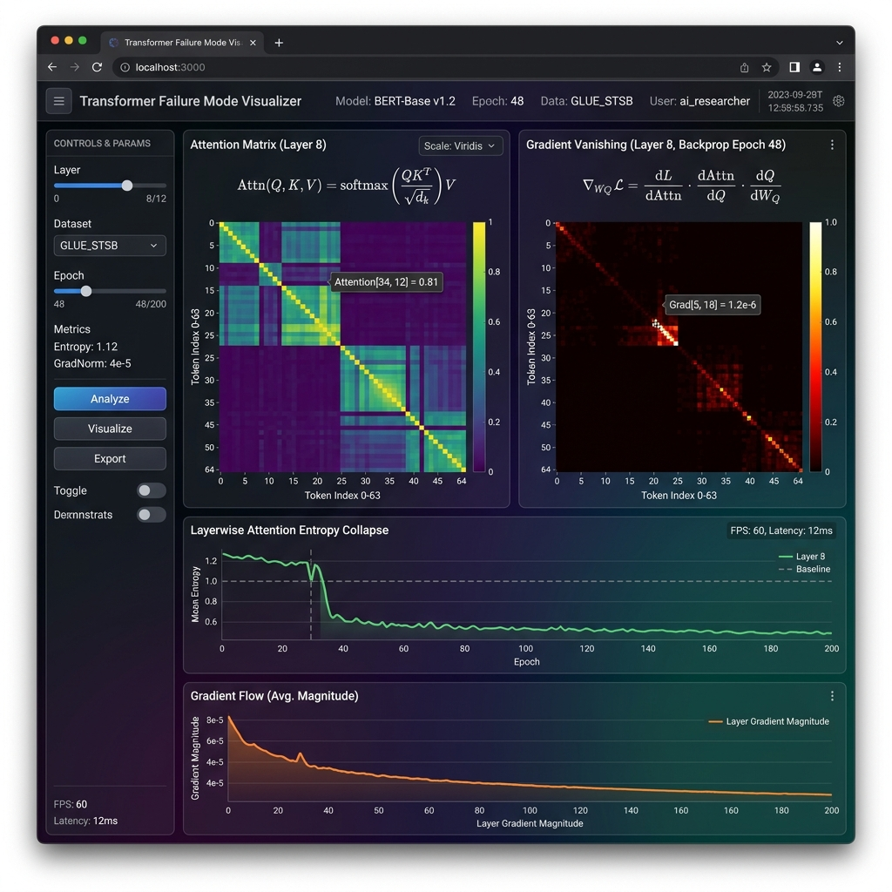
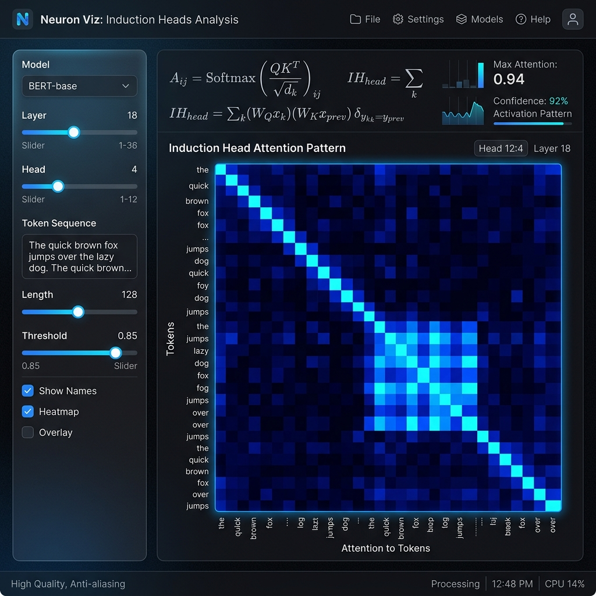

# Transformer Failure Mode Visualizer
**Live Demo:** will be up soon

**Topics:** `transformers`, `mechanistic-interpretability`, `deep-learning`, `visualization`, `attention-mechanism`

An interactive visualizer designed to systematically study the failure modes of the Transformer architecture through raw mathematics. Most educational resources show when transformers work; this visualizer demonstrates when and why they break down.



## Five Primary Mechanisms & Failure Regimes
1. **Attention Entropy Collapse & Gradient Vanishing**: Drag $d_k$ and the temperature $\tau$ to watch the distribution collapse from a smooth surface to a spike, seeing exactly the moment the gradient (plotted locally) vanishes.
2. **Positional Encoding Breakdown**: Manipulate sequence lengths past training boundaries to observe extrapolation failure across Sinusoidal, RoPE, and ALiBi encodings.
3. **Attention Head Redundancy**: We simulate sequences passing through parameterized projection subspaces ($W_Q, W_K$). By varying correlation, heads share parameter spaces, creating mathematically robust identical attention patterns.
4. **Residual Stream Saturation & Logit Lens**: Simulate residual norm growth across layers to find the exact crossover point where Layer Normalization discards early signal, and watch the Logit Lens projection stabilize.
5. **Induction Heads**: Analyze the OV-K composition circuit ($W_K^{(2)} W_{OV}^{(1)}$) mathematically. We extract previous tokens in Layer 1 and compose them to perform true in-context learning in Layer 2.



## Tech Stack
- **React / Next.js ready** (Vite build)
- **TypeScript**
- **Plotly.js** for high-performance interactive visualizations
- **Raw Math**: Custom JS implementations of dot products, JS-divergence, and softmax gradients without heavy ML frameworks.

## Running Locally

1. Install dependencies:
```bash
npm install
```

2. Run the application:
```bash
npm run dev
```


